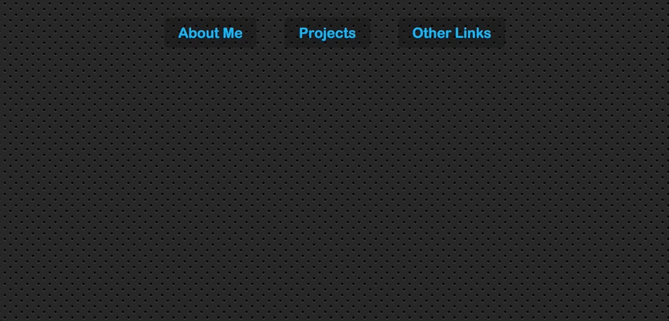

# Navigation Dropdown with Follow Along Effect

The dropdown menu follows along as the user is checking out navbar sections.

Live version: https://navigation-dropdown.herokuapp.com



## Tech stack
* Node
* Express
* Heroku
* Vanilla JavaScript
* ES6
* Flexbox

## Getting started

```sh
git clone https://github.com/PiotrBerebecki/navigation-dropdown-follow-along.git
cd navigation-dropdown-follow-along
npm install

#1. Start the development server with Browsersync reloading
npm run dev

#2. Open this url in your browser: http://localhost:3000/public/index.html
```
